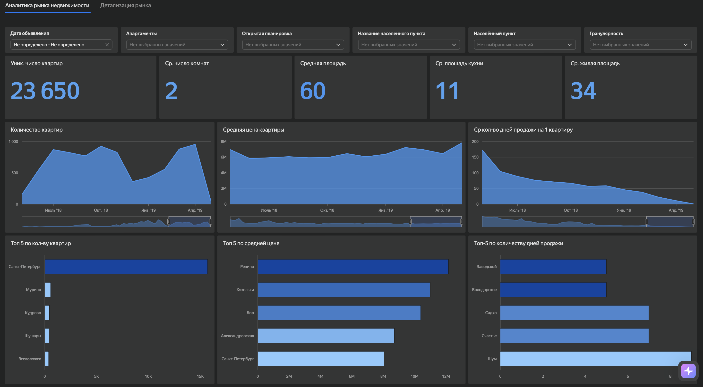
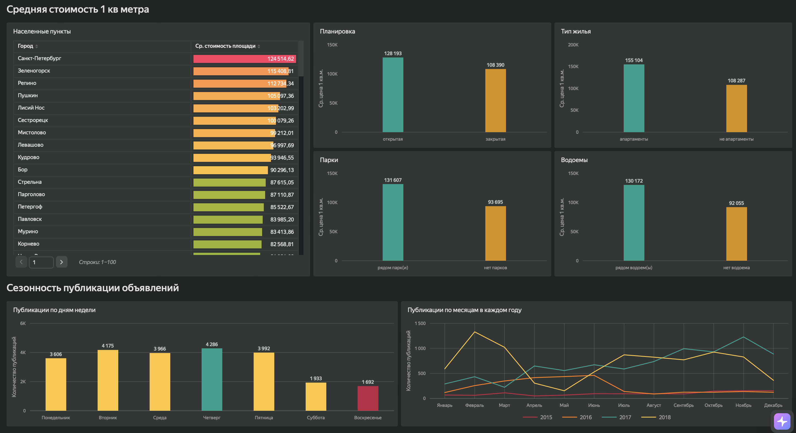

# Анализ рынка недвижимости Санкт-Петербурга и Ленинградской области

## О проекте

Агентству недвижимости необходимо определить наиболее перспективные сегменты рынка жилой недвижимости Санкт-Петербурга и Ленинградской области.

Цель проекта — исследовать рынок недвижимости, определить особенности продажи квартир и сезонность объявлений, а также выявить характеристики объектов, связанные со скоростью продажи и стоимостью жилья.

Анализ проведён по данным сервиса Яндекс Недвижимость за 2015–2018 годы.

## Задачи

В рамках проекта:

- проведена фильтрация аномальных значений по характеристикам недвижимости;
- исследована длительность активности объявлений;
- проведено сравнение рынка Санкт-Петербурга и Ленинградской области;
- проанализирована связь характеристик квартир с длительностью их продажи;
- исследована сезонность публикации и снятия объявлений;
- определены наиболее активные месяцы рынка;
- разработан интерактивный дашборд для анализа рынка недвижимости.

## Дашборд

**[Открыть интерактивный дашборд в Yandex DataLens](https://datalens.yandex/jvzbcg2nydis4)**

### Аналитика рынка недвижимости

### Детализация рынка

## Возможности дашборда

Дашборд позволяет:

- отслеживать ключевые показатели рынка недвижимости;
- анализировать динамику количества объявлений, средней стоимости квартир и длительности продажи;
- сравнивать населённые пункты по количеству объектов, средней цене и сроку продажи;
- исследовать среднюю стоимость квадратного метра в зависимости от характеристик жилья;
- анализировать сезонность публикации объявлений;
- фильтровать данные по периоду, типу жилья, планировке, населённому пункту и другим характеристикам объектов.

## Инструменты

**PostgreSQL · Yandex DataLens**

В SQL-анализе использованы:

`CTE`, `JOIN`, `CASE`, подзапросы, агрегатные и оконные функции, `PERCENTILE_CONT`, `PERCENTILE_DISC`, `RANK`, `COALESCE`, работа с датами.

В Yandex DataLens разработан интерактивный дашборд с индикаторами, селекторами, таблицами и различными типами визуализаций.

## Основные результаты

- Рынок Санкт-Петербурга заметно отличается от остальных населённых пунктов Ленинградской области: квартиры в городе в среднем больше по площади и дороже в пересчёте на квадратный метр.
- Более длительная экспозиция объявлений связана с большей средней площадью и более высокой стоимостью квадратного метра, особенно в Санкт-Петербурге.
- В Санкт-Петербурге значительная часть объявлений закрывается в течение первых трёх месяцев, однако присутствует и существенная доля объектов с длительной экспозицией.
- Наибольшее количество новых объявлений приходится на осенний период: лидируют октябрь и ноябрь.
- Пик снятия объявлений приходится на ноябрь, октябрь и декабрь, что указывает на повышенную активность рынка в конце года.
- Среди населённых пунктов Ленинградской области выделяются Мурино, Кудрово, Шушары, Всеволожск и Парголово — на них приходится значительная часть объявлений за пределами Санкт-Петербурга.

## Рекомендации

- При планировании продаж учитывать выраженную сезонность рынка и повышенную активность покупателей и продавцов в осенний период.
- Отдельно анализировать Санкт-Петербург и населённые пункты Ленинградской области из-за различий в стоимости и характеристиках объектов.
- Для объектов с длительной экспозицией дополнительно анализировать соответствие цены характеристикам квартиры и текущему рынку.
- При работе в Ленинградской области учитывать различия между отдельными населёнными пунктами и концентрироваться на наиболее активных локальных рынках.

## Файлы проекта

- `real-estate-market-analysis.sql` — SQL-запросы для исследования рынка недвижимости и сезонности объявлений;
- `dashboard-overview.png` — основная страница дашборда;
- `dashboard-details.png` — детализация рынка и анализ сезонности.
